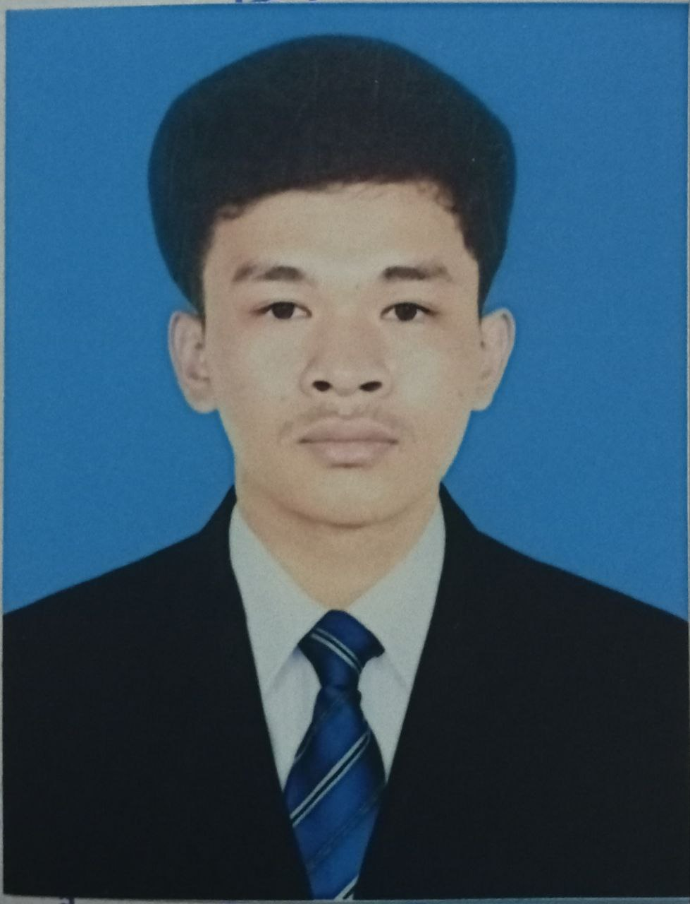

<!DOCTYPE html>
<html lang="en">
<head>
 <meta charset="UTF-8">
    <meta name="viewport" content="width=device-width, initial-scale=1.0">
    <title>NHAM CHAMNES</title>
</head>

<body>
            <h1>CURRICULUM VITAE</h1>
 

        

            

                
   

   

    <h2>Contact</h2>
    
<b>Email :</b> nhamchamnes@gmail.com

    
<b>Mobile phone :</b> +855 90740433

                
<b>Address :</b> Toul Sompov2, Toul Sangkae, Ruessei Keo, Phnom Phenh.

                
<a target = "_blank" href="https://youtu.be/zl_qCaBd_7o?si=IuyDioXmN_bJKR1F">Youtube</a>

   

   

    <h2>Skills</h2>
    <ul>
     <li>Microsoft Office : Word, Exel, Powerpoint</li>
     <li>PhotoShop : Edit Picture</li>
     <li>Communication : Good</li>
    </ul>
   

   

    <h2>Language</h2>
    <ul>
     <li>English</li>
     <li>Khmer</li>
    </ul>
   

   

    <h2>Hobbies</h2>
    <ul>
     <li>Playing : cooking, Guitar,sing</li>
     <li>Reading: Books</li>
    </ul>
   

  

  

   

    <h1>NHAM CHAMNES</h1>
   

   

    
Programmer

   

   

    <h2>Summary</h2>
    
My goal and passion is that I like to solve difficult problem, research 
        and learn from those who are better than me. I like to learn from others 
        and be able to develop a passion for something even if I don't like it. For 
        that purpose, I want to be a programmer and have a clear job.
    

   

   

    <h2>Experience</h2>
    
Join workshop with my scholarship:

    <ul>
     <li>What I gained from this workshop was digital knowledge, skills for develop 
        this field and tips for learning code.</li>
    </ul>
                
Volunteer in Social and Digital development Organization:

                <ul>
                    <li>This Organization has given me an understanding of the 
                        knowledge and benefits of using digital media and how 
                        to divelop a better life using digital.</li>
                </ul>
   

   

    <h2>Education</h2>
    <table>
     <tr>
      <th>University/HightSchool/SecondarySchool/PrimarySchool </th>
      <th>Passing year </th>
      <th>percentage/cgpa</th>
     </tr>
     <tr>
      <td>National University Of Management</td>
      <td>2023</td>
      <td>3.65</td>
     </tr>
     <tr>
      <td>Hun Sen Ponhea Krek</td>
      <td>2019-2022</td>
      <td>99.18</td>
     </tr>
                    <tr>
      <td>Hunsen Popel</td>
      <td>2016-2019</td>
      <td>95%</td>
     </tr>
                    <tr>
      <td>Bonrany Hun Sen khsak</td>
      <td>2010-2016</td>
      <td>90%</td>
     </tr>
    </table>
   

  

 

</body>

</html>
